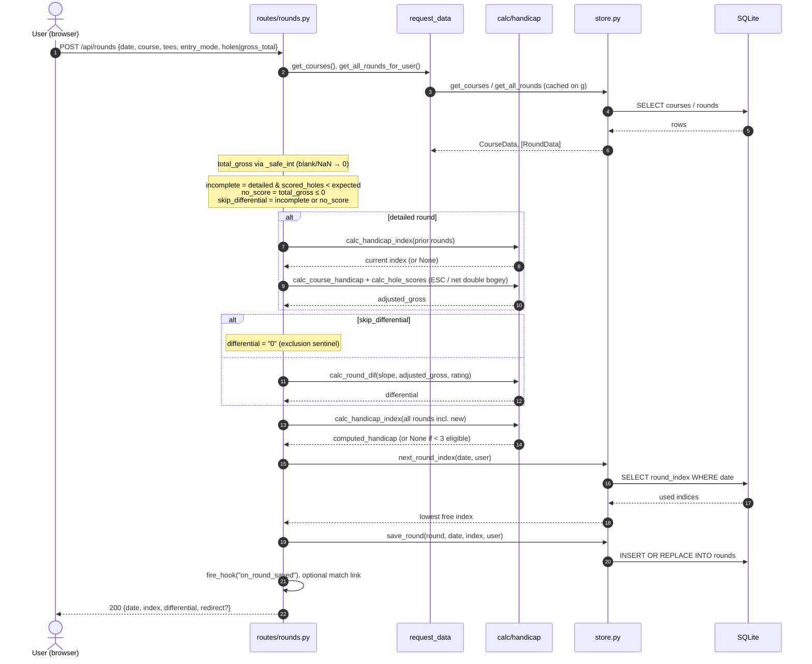
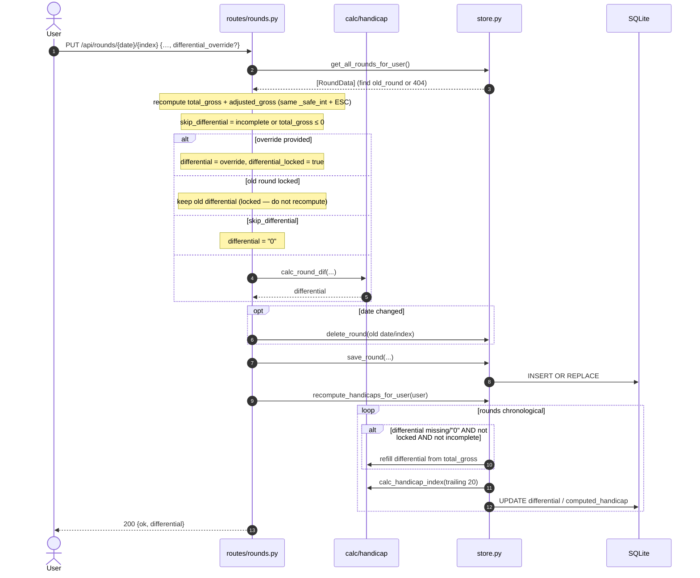
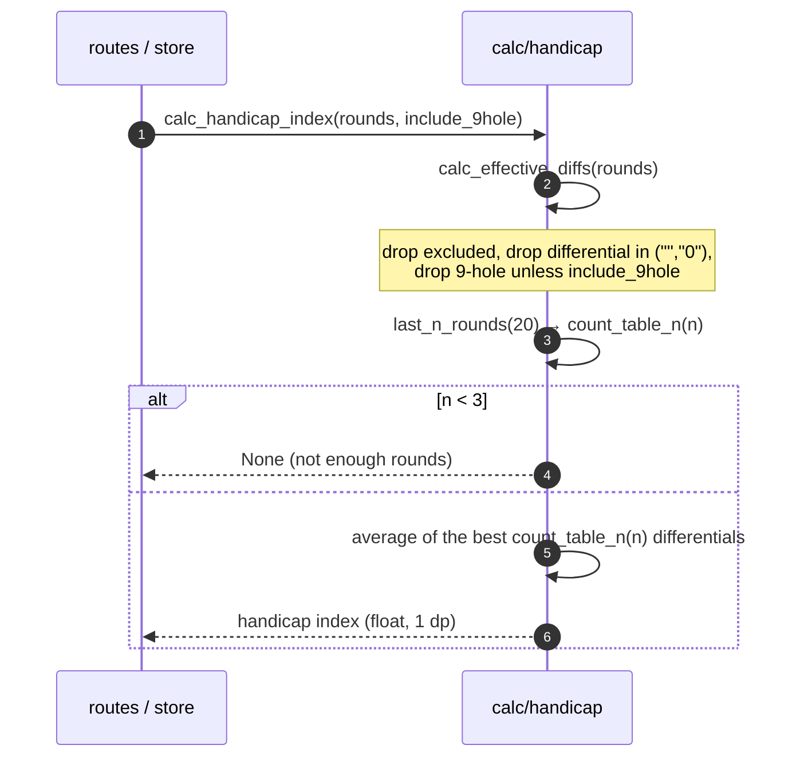
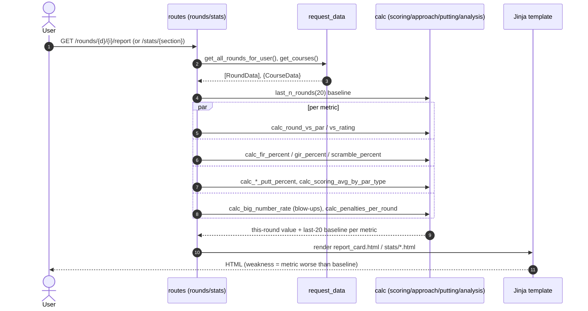
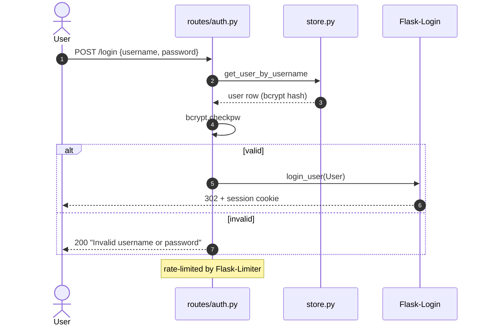
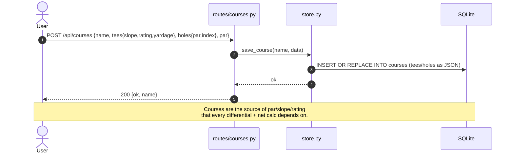

# Sequence Diagrams

Mermaid diagrams for the core flows. Participant names map to real modules:
`routes/*` = `source/routes/…`, `store` = `source/store.py`,
`calc` = `source/calc/…`, `db` = SQLite via `source/database.py`.

---

## 1. Add a round (score entry) — `POST /api/rounds`

`source/routes/rounds.py :: api_rounds_post`

**Why the guards exist:** a blank/non-numeric gross used to 500; a second
same-day round used to overwrite the first (index hardcoded `0`); an incomplete
round produced a wildly negative differential that poisoned the handicap. See
`INVARIANTS.md`.

---

## 2. Edit a round + recompute cascade — `PUT /api/rounds/<date>/<index>`

`source/routes/rounds.py :: api_rounds_put` → `store.recompute_handicaps_for_user`

> **Cascade gotcha (fixed):** the cascade treats `differential == "0"` as "needs
> computing" and refills it from `total_gross`. Without the
> `_is_incomplete_round` guard it would *resurrect* an incomplete round's poison
> differential on the next edit/exclude/delete. The guard keeps `"0"` sticky for
> incomplete rounds.

---

## 3. Handicap index computation — `calc.calc_handicap_index`

`source/calc/handicap.py`

---

## 4. Score evaluation — report card & stats (read path)

`source/routes/rounds.py :: report_card`, `source/routes/stats.py`

> There is **no** single strokes-gained/"fix this first" output — the category
> deltas are the signal, diagnosis is left to the reader. A ranked
> `calc_improvement_priorities()` would be the natural place to add one.

---

## 5. Login / auth

`source/routes/auth.py`, `main._load_user`

---

## 6. Create a course — `POST /api/courses`

`source/routes/courses.py`

